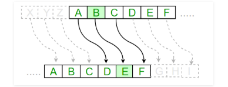
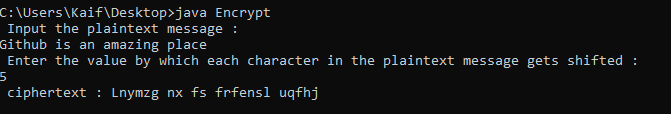
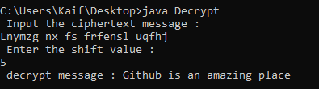

# CaesarCipher

Caesar Cipher in Cryptography. The Caesar Cipher technique is one of the earliest and simplest method of encryption technique. It's simply a type of substitution cipher, i.e., each letter of a given text is replaced by a letter some fixed number of positions down the alphabet.

# Working
[

For example with a shift of 1, A would be replaced by B, B would become C, and so on. The method is apparently named after Julius Caesar, who apparently used it to communicate with his officials.
Thus to cipher a given text we need an integer value, known as shift which indicates the number of position each letter of the text has been moved down.
The encryption can be represented using modular arithmetic by first transforming the letters into numbers, according to the scheme, A = 0, B = 1,…, Z = 25. 

# Algorithm
Input:

                       A String of lower case letters, called Text.
                       An Integer between 0-25 denoting the required shift.
Procedure:

                  Traverse the given text one character at a time .
        For each character, transform the given character as per the rule, depending on whether we’re encrypting or decrypting the text.
      Return the new string generated.

# Encryption

Function:- https://github.com/iamkaiff/CaesarCipher/blob/master/Encrypt.java#L20 

# Decryption

Function:- https://github.com/iamkaiff/CaesarCipher/blob/master/Decrypt.java#L20

# Action
For Compilation of code just give this command on cmd for particular code:-

                javac Encrypt.java/ Decrypt.java
To perform encrpytion/decryption just give this command on cmd after compilation of Encrypt/Decrypt code:- 

                     java Encrypt/Decrypt
                    
So, thats All for now!

Have Fun :-)

# Credits
A big thanks to www.javahungry.blogspot.com for helping me to make this project quite simple and bring this thing in front of you people.
