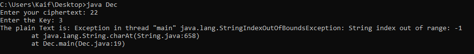

# CaesarCipher

Caesar Cipher in Cryptography. The Caesar Cipher technique is one of the earliest and simplest method of encryption technique. It's simply a type of substitution cipher, i.e., each letter of a given text is replaced by a letter some fixed number of positions down the alphabet.

# Working

For example with a shift of 1, A would be replaced by B, B would become C, and so on. The method is apparently named after Julius Caesar, who apparently used it to communicate with his officials.
Thus to cipher a given text we need an integer value, known as shift which indicates the number of position each letter of the text has been moved down.
The encryption can be represented using modular arithmetic by first transforming the letters into numbers, according to the scheme, A = 0, B = 1,…, Z = 25. 

# Algorithm
Input:

                       A String of lower case letters, called Text.
                       An Integer between 0-25 denoting the required shift.
Procedure:

        Traverse the given text one character at a time .
        For each character, transform the given character as per the rule, depending on whether we’re encrypting or decrypting the text.
        Return the new string generated.

# Encryption

Function:- https://github.com/iamkaiff/CaesarCipher/blob/master/Encrypt.java#L20 

# Decryption

Function:- https://github.com/iamkaiff/CaesarCipher/blob/master/Decrypt.java#L20

# Numbers 
For Encryption and Decryption of numbers we have seperate code for this:

But we have some limitations for decrypting the numbers which they listed below:
# Limitations

    This can  Decrypt only those numbers which comes between only 0-9  and if range exceeds then it will show error.
    let us consider a example: if ciphertext is 22 and shift is of 3 then answer must be 99 but this will reflect error that string index out of range .

No limitations for Encryption of numbers.
To Encrypt and Decrypt alphabets,word,sentence there is also no such limitations.
# Additional
In additionally i tried to implement Caesar Cipher technique on Hindi language but unfortunately i cannot meet the expectation.

I have searched and find almost everything i could be on internet,on blogs but not a single idea i get about it.

Some of the programs i made by my own as an experiment to try that but nothing happend as i wanted.

# Action
For Compilation of code just give this command on cmd for particular code:-

                javac Encrypt.java/ Decrypt.java
                javac Enc.java/ Dec.java
To perform encrpytion/decryption just give this command on cmd after compilation of Encrypt/Decrypt code:- 

                     java Encrypt/Decrypt
                     java Enc/ Dec
                    
So, thats All for now!

I hope that my findings & attempts you will admire.

Have Fun :-)

# Credits
A big thanks to www.javahungry.blogspot.com & www.codeproject.com for helping me to make this project quite simple and bring this thing in front of you people.
